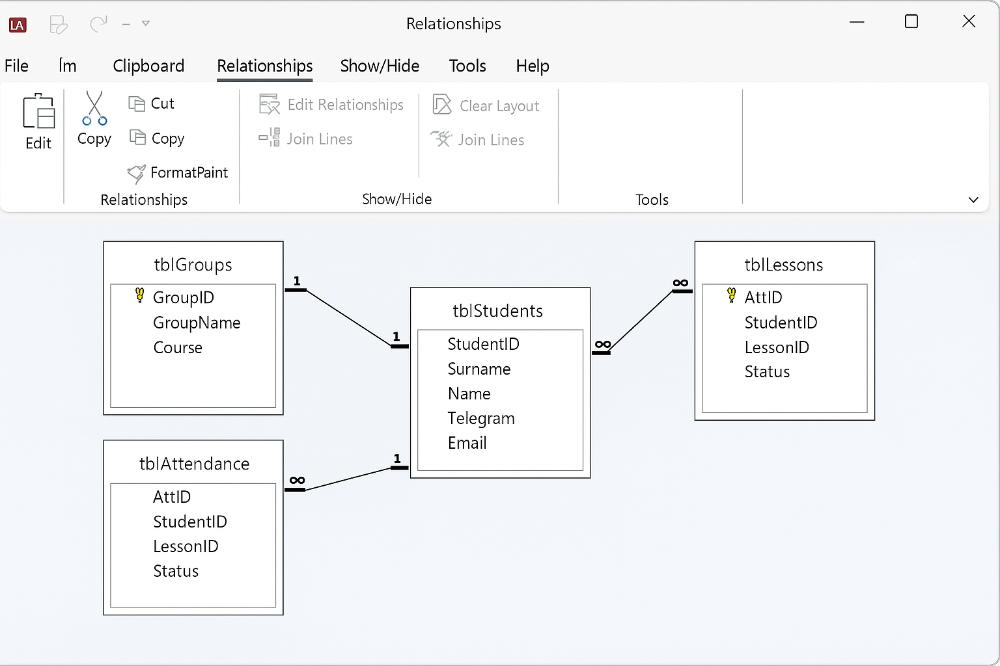
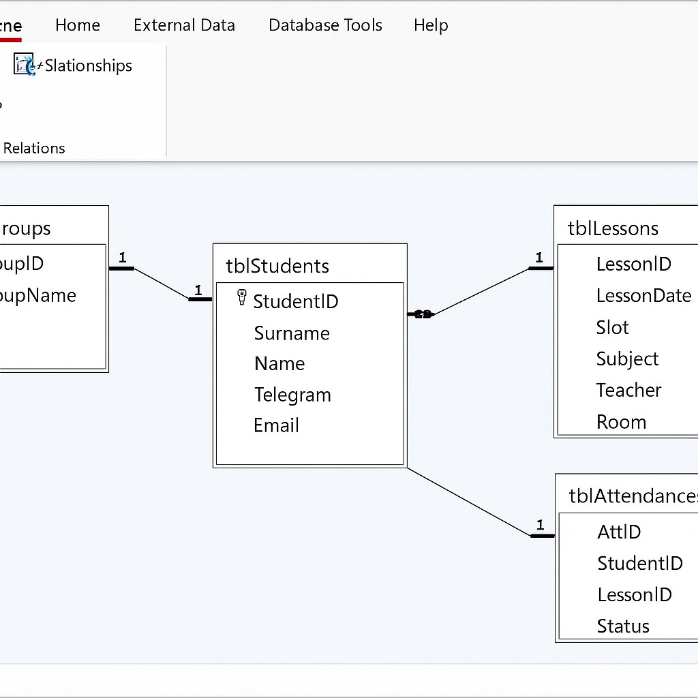
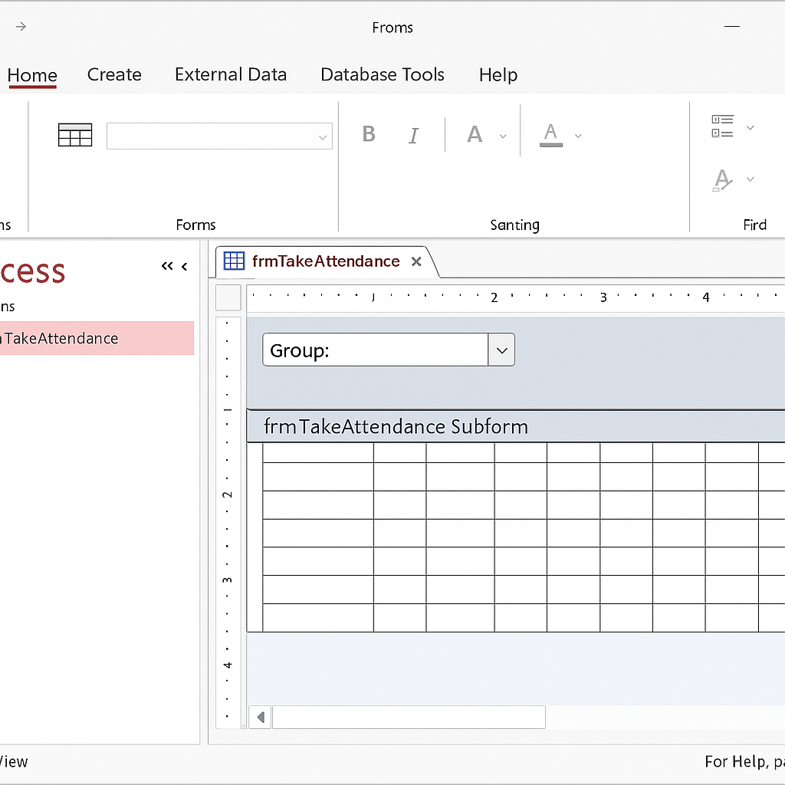
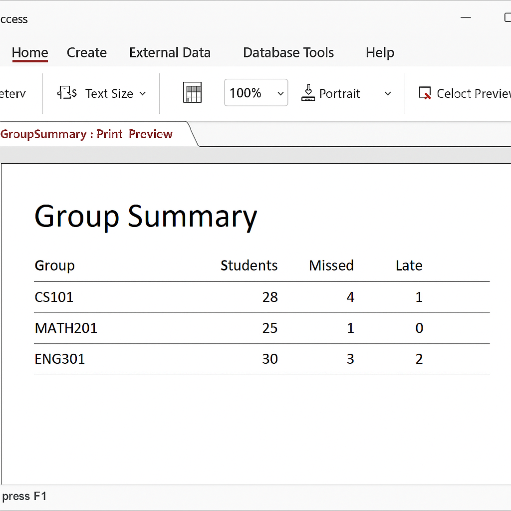

# Acces_ASU
# Гайд «без права на фейл»: Журнал пропусков в MS Access

> Полный чек‑лист для старосты. Следуй шагам — и ни один пропуск не потеряется.

## 0. Разогрев

1. Установи Microsoft Access (из состава Office 365 или 2021).  
2. Запусти **Blank Database**.  
3. Назови файл `Attendance.accdb`, нажми **Create**.



---

## 1. Таблица Groups (`tblGroups`)

| Поле      | Тип данных      | Особенности            |
|-----------|-----------------|------------------------|
| GroupID   | AutoNumber (PK) | Первичный ключ         |
| GroupName | Short Text      | Название группы        |
| Course    | Number          | Курс (1–4)             |

Сохрани таблицу как **tblGroups**.

---

## 2. Таблица Students (`tblStudents`)

| Поле     | Тип данных      | Особенности                |
|----------|-----------------|----------------------------|
| StudentID| AutoNumber (PK) |                            |
| Surname  | Short Text      |                            |
| Name     | Short Text      |                            |
| Telegram | Short Text      | `@username`                |
| Email    | Short Text      |                            |
| GroupID  | Number (FK)     | Ссылка на `tblGroups`      |

---

## 3. Таблица Lessons (`tblLessons`)

| Поле       | Тип данных      | Описание                |
|------------|-----------------|-------------------------|
| LessonID   | AutoNumber (PK) |                         |
| LessonDate | Date/Time       | Дата                    |
| Slot       | Number          | № пары (1–6)            |
| Subject    | Short Text      |                         |
| Teacher    | Short Text      |                         |
| Room       | Short Text      |                         |

---

## 4. Таблица Attendance (`tblAttendance`)

| Поле      | Тип данных      | Описание                           |
|-----------|-----------------|------------------------------------|
| AttID     | AutoNumber (PK) |                                    |
| StudentID | Number (FK)     | На `tblStudents`                   |
| LessonID  | Number (FK)     | На `tblLessons`                    |
| Status    | Short Text      | `Present`, `Absent`, `Late`, `Excused` |

---

## 5. Связи

Открой **Database Tools → Relationships**:

- `tblGroups.GroupID` → `tblStudents.GroupID` (**1:М**).  
- `tblStudents.StudentID` → `tblAttendance.StudentID` (**1:М**).  
- `tblLessons.LessonID` → `tblAttendance.LessonID` (**1:М**).  

Поставь галочки **Enforce Referential Integrity** и **Cascade Delete**.



---

## 6. Формы‑справочники

Создай простые формы **tblGroups** и **tblStudents** через **Create → Form** и добавь по несколько тестовых записей.

---

## 7. Главная форма `frmTakeAttendance`

1. **Create → Form Design**.  
2. В шапке размести **ComboBox** `cboLesson` (источник: `tblLessons`, `LessonID`).  
3. Добавь **Subform** (табличный режим) на запрос `qryStudentsOfLesson`, выводящий студентов группы выбранного урока.  
4. В сабформе поля `Surname`, `Name`, Checkbox `Absent?`, Checkbox `Excused?`.  



---

### VBA: авто‑создание строк Attendance

```vba
' В модуле формы frmTakeAttendance
Private Sub cboLesson_AfterUpdate()
    Dim sql$
    sql = "INSERT INTO tblAttendance (StudentID, LessonID, Status) " & _
          "SELECT StudentID, " & Me.cboLesson & ", 'Present' " & _
          "FROM tblStudents " & _
          "WHERE GroupID = " & _
              DLookup(""GroupID"", ""tblLessons"", ""LessonID="" & Me.cboLesson)
    CurrentDb.Execute sql, dbFailOnError
    Me.subAttendance.Requery
End Sub
```

Кнопка **Mark All Present**:

```vba
Private Sub cmdAllPresent_Click()
    With Me.subAttendance.Form.RecordsetClone
        .MoveFirst
        Do Until .EOF
            .Edit
            !Status = "Present"
            .Update
            .MoveNext
        Loop
    End With
    Me.subAttendance.Requery
End Sub
```

---

## 8. Условное форматирование

`Status = "Absent"` → красный фон,  
`Status = "Late"` → жёлтый фон.  

---

## 9. Запросы

- **qryDailyMiss** – пропуски за сегодня:  
  ```sql
  SELECT S.Surname, S.Name, L.Subject, L.Slot
  FROM (tblAttendance A
    INNER JOIN tblStudents S ON A.StudentID = S.StudentID)
    INNER JOIN tblLessons L ON A.LessonID = L.LessonID
  WHERE L.LessonDate = Date() AND A.Status = 'Absent';
  ```

- **qryGroupSummary** – сводка по группе/студенту:  
  ```sql
  SELECT G.GroupName, S.Surname, S.Name,
         Sum(IIf(Status='Absent',1,0)) AS Missed,
         Sum(IIf(Status='Late',1,0))   AS Late
  FROM ((tblGroups G
    INNER JOIN tblStudents S ON G.GroupID=S.GroupID)
    INNER JOIN tblAttendance A ON S.StudentID=A.StudentID)
    INNER JOIN tblLessons L ON A.LessonID=L.LessonID
  GROUP BY G.GroupName, S.Surname, S.Name;
  ```

---

## 10. Отчёты

- **rptGroupSummary** на `qryGroupSummary`.  
- **rptDailyMiss** на `qryDailyMiss`.  



---

## 11. Навигационная форма

**Create → Navigation Form** и перетяни:

- «Отметить» – `frmTakeAttendance`  
- «Группы» – форма Groups  
- «Студенты» – форма Students  
- «Отчёты» – `rptGroupSummary`, `rptDailyMiss`

В **Options → General** поменяй **Office Theme** на «Black» (тёмная тема).

---

## 12. Экспорт и почтовые предупреждения

### Export

```vba
DoCmd.OutputTo acOutputReport, "rptGroupSummary", acFormatPDF, _
               "C:\Reports\GroupSummary_" & Format(Date, "yyyymmdd") & ".pdf"
```

### Почта (Outlook)

```vba
Sub SendWarning(stuID As Long)
    Dim oApp As Outlook.Application
    Dim oMail As Outlook.MailItem
    Set oApp = New Outlook.Application
    Set oMail = oApp.CreateItem(olMailItem)

    With oMail
        .To = DLookup("Email","tblStudents","StudentID=" & stuID)
        .Subject = "Пропуски: пора на пары 🚨"
        .Body = "Ты пропустил уже " & _
                 DLookup("Missed","qryStudentStats","StudentID=" & stuID) & _
                 " пар. Некрасиво!"
        .Send
    End With
End Sub
```

---

## 13. Бэкап

- **Database Tools → Back Up Database** (ручной).  
- Или «split database»: backend `Attendance_BE.accdb` на сетевом диске, frontend у каждого.  

---

## 14. Лайф‑хаки

| Что | Как |
|-----|-----|
| **Compact & Repair** | Файл → Info → Compact & Repair |
| Список значений `Status` | `"Present";"Absent";"Late";"Excused"` |
| Логи ошибок | `tblLog` + `On Error GoTo Handler` |
| Автобэкап при запуске | VBA: `FileCopy` backend к `\\share\Backups\%date%` |

---
